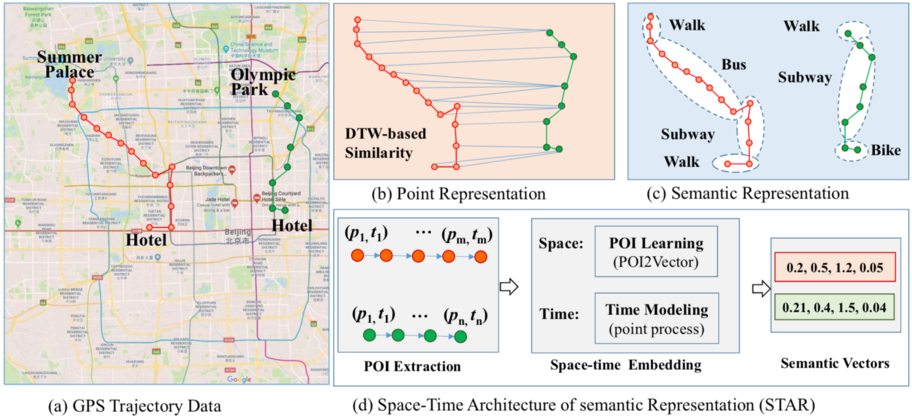

## STAR: A Space-Time Architecture for Semantic Trajectory Representation 

#### Junming Shao, Weiwen Xu, Honglian Wang, Ruizhi Wu, **<u>Chongming Gao</u>**, Qinli Yang

<abstract>Trajectory data has been generated at an explosive rate in recent years due to the increasing use of location-aware devices. To mine trajectory data, a critical task is to learn a good trajectory representation since it is essential to downstream mining tasks such as trajectory retrieval and clustering. Established representation approaches tend to ignore the temporal information carried in trajectories, or treat spatial and temporal information separately. However, such strategy may be hard to reflect the reality. Beyond, the semantic information in trajectories is insufficiently exploited and enriched in existing approaches. In this paper, we propose a Space-Time Architecture for semantic trajectory Representation, called STAR, which simultaneously learns the space and time information carried in trajectories with a united framework. The basic idea is to learn trajectory representation as a bridge to connect location and time information as a whole, by predicting the next visiting location and time via distributed vector representation and adaptive Hawkes process. More importantly, the semantics, are further learned during the trajectory distributed vector representation process in an unsupervised way. Extensive experiments on several real-world trajectory data sets show that our proposed framework not only allows learning a good representation to capture the space and time information effectively, but also has good performance of semantic enrichment.</abstract>

<inf>Rejected from KDD'18, revising, to be submitted. <attached> [[PDF](Star-Shao/star.pdf)]</attached></inf>
