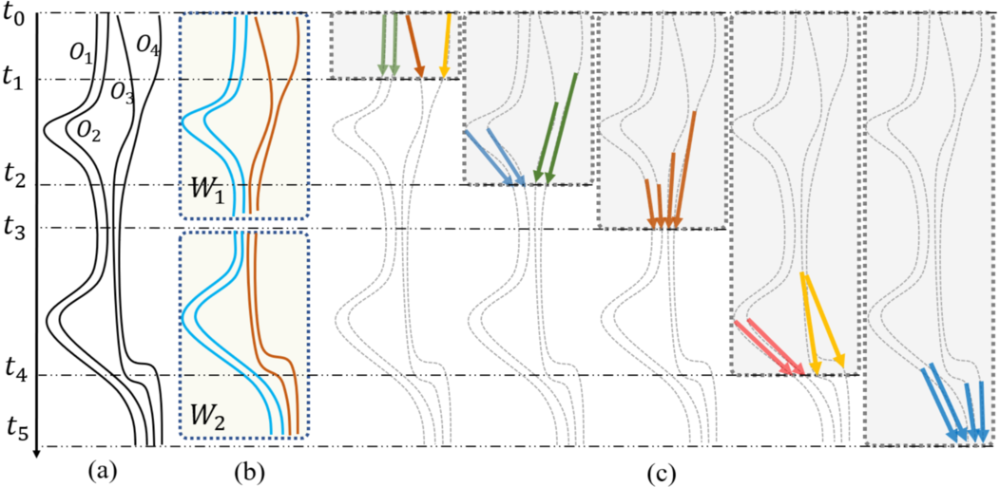

## AntClu: Any-time Trajectory Clustering via Dynamic Trend Representation 

#### Yi Zhao, **<u>Chongming Gao</u>**, Ruizhi Wu, Qinli Yang, Junming Shao

<abstract>In recent years, clustering trajectory data has been extensively explored to discover similar patterns of moving objects. Existing approaches, often cluster whole life-span trajectories into several groups according to some trajectory similarities such as dynamic time warping and edit distance. However, the trajectory of a given moving object is dynamic and evolved over time. Exploring the dynamic grouping patterns of moving objects (e.g., the expanding, shrinking, emerging or disappearing of clusters) over time thus offers a more dedicated venue to analyze the evolved moving patterns. To address this problem, in this paper, we propose a new any-time trajectory clustering algorithm, called AntClu, building upon the concepts of automatic dynamic trend representation and density-based online clustering. The basic idea is to learn a dynamic representation for each trajectory to capture “current trend”, and then cluster these “trends” in an online setting. Therefore, AntClu is capable of clustering trajectories at any time, and time-changing clusters are available whenever the request comes. More importantly, unlike traditional data stream clustering approaches or online learning, AntClu is also independent of time-window. The experimental results on real-world data sets further demonstrate its effectiveness and efficiency.</abstract>

<inf>Prepared to be submitted. <attached> [[PDF](AntClu-Zhao/AntClu.pdf)]</attached></inf>
