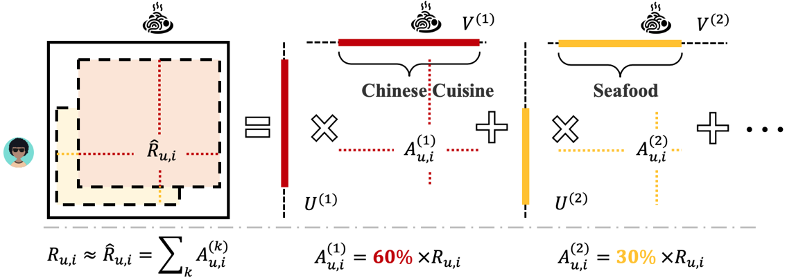

## BLOMA: Explain Collaborative Filtering via Boosted Local Rank-One Matrix Approximation  

#### **<u>Chongming Gao</u>**, Shuai Yuan, Zhong Zhang, Hongzhi Yin, Junming Shao 

<abstract>Matrix Approximation (MA) is a powerful technique in context-aware recommendation systems. By exploiting both the rating data and auxiliary social/item networks, it represents the users and items as well-regularized low-rank latent factors so as to capture user preferences and item attributes. However, there are two main problems in the prevalent MA framework. The most urgent one is that the latent factor is out of explanation, which hampers the understanding of the reasons behind recommendations. Besides, traditional MA methods produce user/item factors globally, which fails to capture the idiosyncrasies of users/items. In this paper, we propose a model called Boosted Local rank-One Matrix Approximation (BLOMA). The core idea is to locally and sequentially approximate the residual matrix (which represents the unexplained part obtained from previous stage) by rank-one sub-matrix. By leveraging social networks and item relationships, the sub-matrix with distinct topic is easily extracted. The experiments show our method has good explanations that other methods never have. Meanwhile, by comparing with state-of-the-art algorithms, we show our model has well-matched prediction accuracy.</abstract>

<inf>Accepted by **DASFAA'19**. <attached> [[Poster](BLOMA-DASFAA/Bloma Poster.pdf)]</attached></inf>
