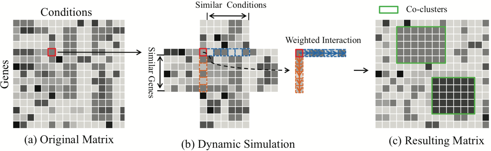

## Synchronization-inspired Co-clustering and Its Application to Gene Expression Data  

#### Junming Shao, **<u>Chongming Gao</u>**, Wei Zeng, Jingkuan Song, Qinli Yang 

<abstract>In this paper, we propose a new synchronization-inspired co-clustering algorithm by dynamic simulation, called CoSync, which aims to discover biologically relevant subgroups embedding in a given gene expression data matrix. The basic idea is to view a gene expression data matrix as a dynamical system, and the weighted two-sided interactions are imposed on each element of the matrix from both aspects of genes and conditions, resulting in the values of all element in a co-cluster synchronizing together. Experiments show that our algorithm allows uncovering high-quality co-clusterings embedded in gene expression data sets and has its superiority over many state-of-the-art algorithms.</abstract>

<inf>Accepted by **ICDM'17**. <attached> [[PDF](CoSync-ICDM/Cosync.pdf)][[Code](CoSync-ICDM/CoSync.zip)]</attached></inf>
