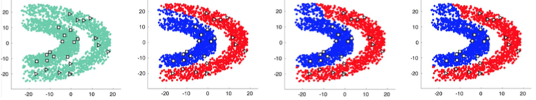

## Online Budgeted Least Squares with Unlabeled Data 

#### Chen Huang, Peiyan Li, **<u>Chongming Gao</u>**, Qinli Yang,  Junming Shao

<abstract>The scarcity of labeled data in real streaming environments has boosted the study of online semi-supervised learning (SSL). However, existing online SSL models often rely on some specific assumptions (e.g., manifold assumption) and need to maintain some extra constraints (e.g., the Laplacian matrix) on the fly, which is usually time and resource consuming. In this paper, we propose an efficient and effective online semi-supervised learning approach via Budgeted Least Square (BLS). Specifically, we first derive both closed-form transductive and inductive solutions for kernel least squares classification in the semi-supervised setting. Then, together with online kernel learning, BLS allows a concise online update. Besides, the theoretical regret bound of BLS is analysed, and empirical experiments on both static and streaming data further demonstrate its superiority over state- of-the-art algorithms.</abstract>

<inf>Accepted by **ICDM'19**. <attached> [[PDF](ICDM-ChenChen/Online Budgeted Least Squares with Unlabeled Data.pdf)]</attached></inf>
