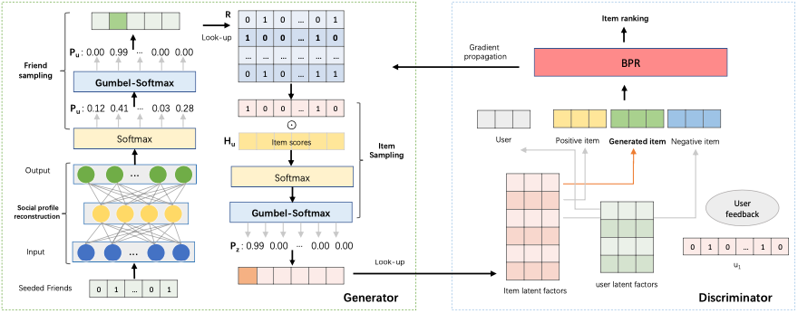

## Generating Reliable Friends via Adversarial Training to Improve Social Recommendation

#### Junliang Yu, Min Gao, Hongzhi Yin, Jundong Li, **<u>Chongming Gao</u>**, Qinyong Wang 

<abstract> Most of the recent studies of social recommendation assume that people share similar preferences with their friends and the online social relations are helpful in improving traditional recommender systems. However, this assumption is often untenable as the online social networks are often very sparse and a majority of users only have a small number of friends. Besides, explicit friends may not share similar interests because of the randomness in the process of building social networks. Therefore, discovering a number of reliable friends for each user plays an important role in advancing social recommendation. Unlike other studies which focus on extracting valuable explicit social links, our work pays attention to identifying reliable friends in both the observed and unobserved social networks. Concretely, in this paper, we propose an end-to-end social recommendation framework based on Generative Adversarial Nets (GAN). The framework is composed of two blocks: a generator that is used to produce friends that can possibly enhance the social recom- mendation model, and a discriminator that is responsible for assessing these generated friends and ranking the items according to both the current user and her friends’ preferences. With the competition between the generator and the discriminator, our framework can dynamically and adaptively generate reliable friends who can perfectly predict the current user’ preference at a specific time. As a result, the sparsity and unreliability problems of explicit social relations can be mitigated and the social recommendation performance is significantly improved. Experimental studies on real-world datasets demonstrate the superiority of our framework and verify the positive effects of the generated reliable friends.  </abstract>

<inf>Accepted by **ICDM'19**. <attached> [[PDF](https://arxiv.org/pdf/1909.03529)][[Code](https://github.com/Coder-Yu/RecQ)]</attached></inf>
