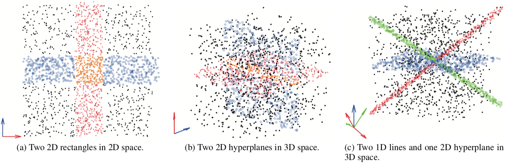

## Towards Robust Arbitrarily Oriented Subspace Clustering

#### Zhong Zhang, **<u>Chongming Gao</u>**, Qinli Yang, Junming Shao 

<abstract>Clustering high-dimensional data is challenging since meaningful clusters usually hide in the arbitrarily oriented subspaces, and thus classical clustering algorithms like k-means tend to fail in such case. Subspace clustering has thus attracted growing attention in last decade, and many algorithms have been proposed such as ORCLUS and 4C. However, existing approaches are usually sensitive to global and/or local noisy points, and the overlapping subspace clusters are little explored. Beyond, these approaches usually involve the exhaustive local search for correlated points or subspaces, which is time consuming. To deal with these problems, in this paper, we introduce a new subspace clustering algorithm, called RAOSC, which formulates the Robust Arbitrarily Oriented Subspace Clustering as a group structure low-rank optimization problem. RAOSC is able to recover subspace clusters from a sea of noise while noise and overlapping points can be naturally identified during the optimization process. Unlike existing low-rank based subspace clustering methods, RAOSC can explicitly produce the subspaces of clusters without any prior knowledge of subspace dimensionality and do not need a post-processing for clustering. Extensive experiments on both synthetic and real-world data sets have demonstrated that RAOSC allows yielding high-quality clusterings and outperforms many state-of-the-art algorithms.  </abstract>

<inf>Accepted by **DASFAA'19**. Best Paper!</inf>
