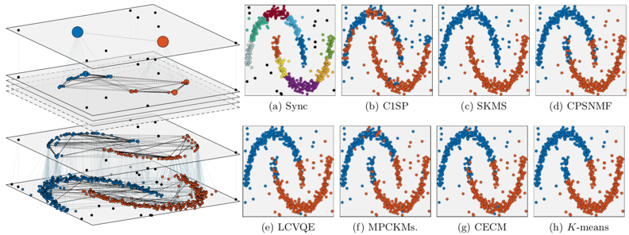

## SemiSync: Semi-supervised Clustering by Synchronization

#### Zhong Zhang, DiDi Kang, **<u>Chongming Gao</u>**, Junming Shao 

<abstract>In this paper, we consider the semi-supervised clustering problem, where the prior knowledge is formalized as the Cannot-Link(CL) and Must-Link(ML) pairwise constraints. Previous works usually solve this problem by introducing additional penalty terms to satisfy the constraints and/or learning a constraint-based distance metric. In this paper, we solve this problem from a novel perspective: synchronization. Inspired by the emerging synchronization models, we propose a new semi-supervised clustering method, called SemiSync. The basic idea is to regard the data points as a set of (constrained) phase oscillators, and simulate their dynamics to form clusters automatically with a proposed constrained interaction model. Thanks to the powerful concept and the desirable property of synchronization, SemiSync allows dynamically propagating the constraints to unlabelled data points driven by their local data distributions, which effectively boosts the clustering performance even if little prior knowledge is available. Besides, it allows us to employ an effective strategy to reduce the computation load. Extensive experiments on synthetic and real-world data sets have demonstrated the effectiveness of our proposed method.  </abstract>

<inf>Accepted by **DASFAA'19**. </inf>
