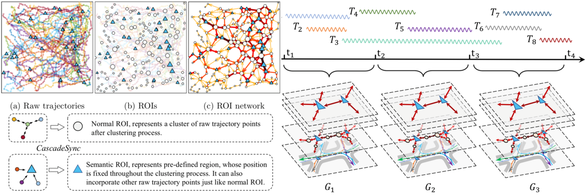

## Semantic Trajectory Compression via Multi-resolution Synchronization-based Clustering 

#### **<u>Chongming Gao</u>**, Yi Zhao, Ruizhi Wu, Qinli Yang, Junming Shao

<abstract>With the pervasive use of location-aware devices and rapid development of location sensing technology, trajectory data has been generated in diverse fields. How to store and manage these large amounts of data is a non-trivial task, and thus trajectory compression has gained increasing attention in recent years. As traditional compression algorithms often treat trajectories as sequences of lines in geometric space, the global statistics and the semantics embedded in trajectories are not well considered. Inspired by the powerful concept of synchronization, in this paper we introduce a new semantic trajectory compression approach, called *CascadeSync*, to yield multi-resolution trajectory abstractions with semantic enrichment. The basic idea is to introduce a multi-resolution synchronization-based clustering model to produce semantic regions-of-interest (ROIs) in a hierarchical way. Specifically, by imposing constraints on points with semantic information in the interaction model, all neighboring points with similar semantics will group together automatically. Afterwards, each trajectory is compressed as a sequence of semantic ROIs and is further represented as a hierarchical ROI network. Beyond, we further extend our model on the data stream setting. The extensive experiments on synthetic data and four real-world data sets have demonstrated the effectiveness and efficiency of our proposed model.</abstract>

<inf>Submitted to *Knowledge-Based Systems* (**KBS**), still under review. <attached> [[PDF](TraCompression-KBS/Compression_KBS.pdf)]</attached></inf>
