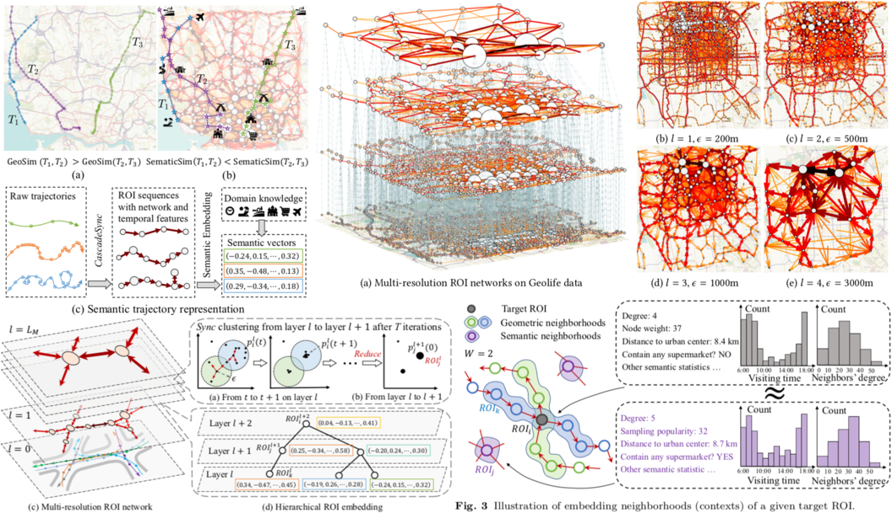

## Semantic Trajectory Representation and Retrieval via Hierarchical Embedding 

#### **<u>Chongming Gao</u>**, Chen Huang, Zhong Zhang, Qinli Yang, Junming Shao

<abstract>Trajectory mining has gained growing attentions due to its wide emerging applications, such as location-based service, urban computing and movement behavior analysis. One critical and fundamental mining task is to retrieve certain locations or trajectories that satisfy particular patterns. However, it becomes a tricky problem to query various semantic patterns from traditional trajectory databases, since most existing approaches mainly represent the trajectory as a collection of geographic and temporal features, and the latent semantic properties are little considered. In this paper, we introduce a new semantic trajectory representation method, incorporating trajectory structures, temporal information as well as domain knowledge to make efficient semantic retrieval possible. Specifically, to extract structures from disordered raw trajectories, a synchronization-based model is first introduced to identify multi-resolution regions of interest (ROIs). Relying on the hierarchical ROI network, a hierarchical embedding model is further proposed to embed ROIs as well as trajectories as continuous vectors. Most importantly, the metric in this embedding vector space is tailored to express the semantic similarity. As a result, users can easily retrieve desirable ROIs or trajectories by computing the Euclidean distance among embedded vectors. Empirical experiments on synthetic data and four real-world data sets show that our approach extracts semantic trajectory information effectively, which allows retrieving more similar and interpretable trajectories, by comparing with four state-of-the-art similarity metrics, including DTW, LCSS, EDR and Fr\'echet distance.</abstract>

<inf>Submitted to *Information Sciences* (**DMKD**), under minor revision. <attached> [[PDF](TraEmbedding-DMKD/Embedding_DMKD.pdf)]</attached></inf>
